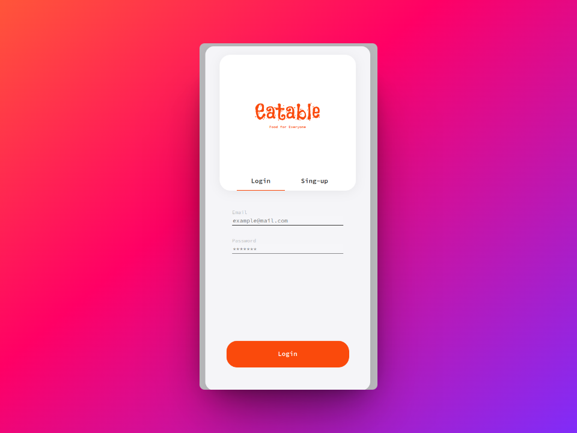
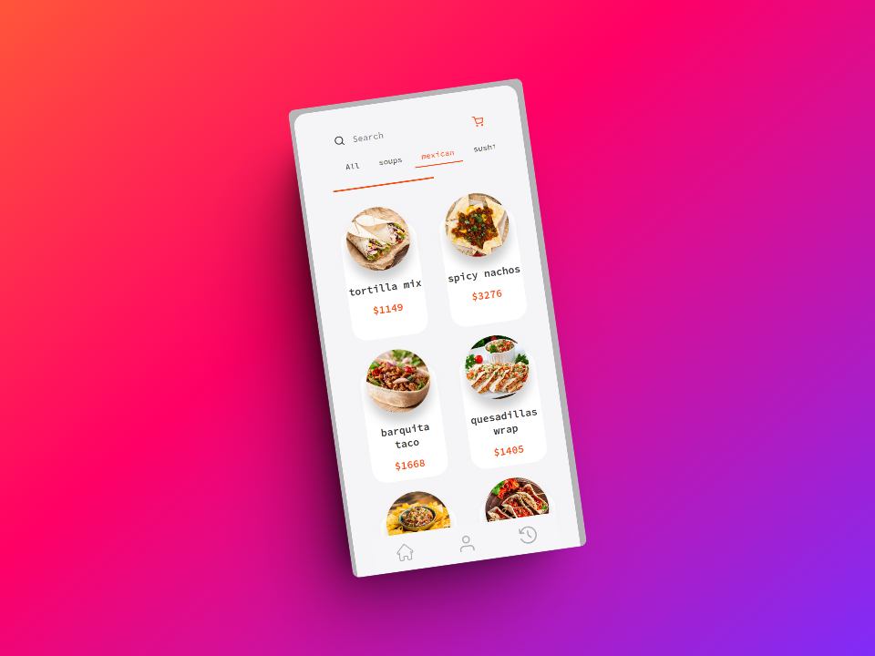
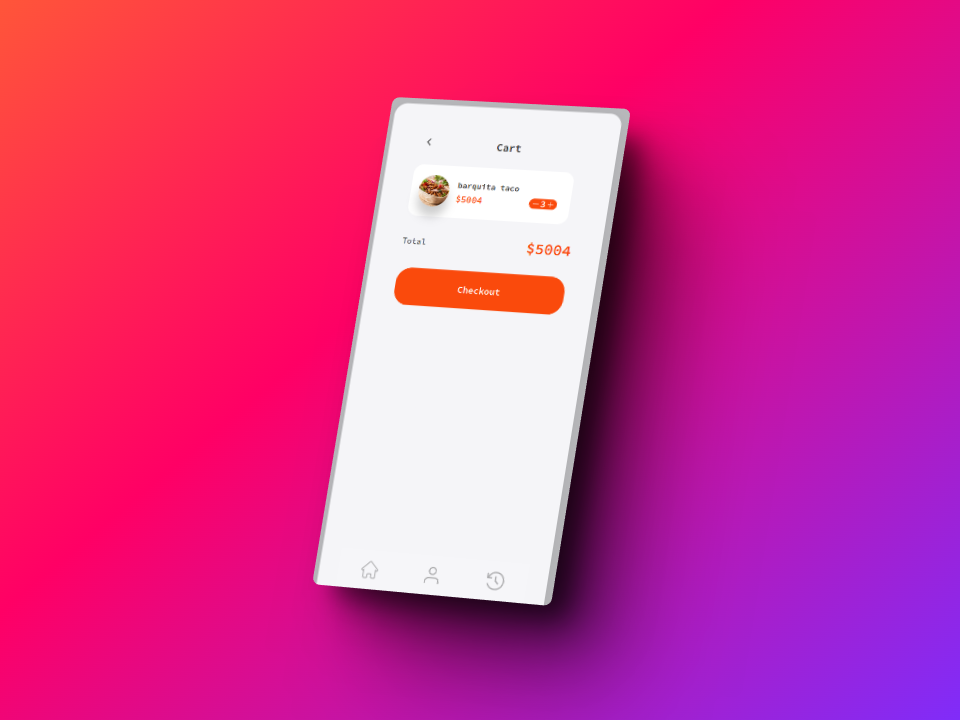

# Eatable

This is an app where you can find many delicious food and choose what you like. In addition, you can see the orders that you made and its details.

## Screenshots

   
   
   

## Built With

- [React](https://react.dev/)
- [TypeScript](https://developer.mozilla.org/es/docs/Web/JavaScript)
- [Zustand](https://zustand.docs.pmnd.rs/)
- [Tailwind CSS](https://tailwindcss.com/)
- [Netifly](https://www.netlify.com/)

## Getting Started

To get a local copy up and running follow these steps.

### Prerequisites

- Bun

### Installation

1. Clone the repo, or download the zip file

   ```bash
   git clone git@github.com:Camilo-J/Eatable.git
   ```

2. Install NPM packages

   ```bash
   bun install
   ```

3. Run the app

   ```bash
   bun run dev
   ```

## License

Distributed under the MIT License. See `LICENSE` for more information.
